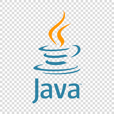

# 😁 About me

Graduated from Instituto Federal Rio-grandense (IFSUL) in the end of 2023, i am search my first job oportunity in the technology area. 

**
Name: Fernando de Barros
**
**
Age: 20 years old
**
**
Principally programming language: Java/Kotlin
**
**Am I workin? no**

## Contacts
- Instagram: [@f.barros.nando](https://www.instagram.com/f.barros.nando/)
- Discord: @fernandozoeirobr
- Twitter: [@fbarrosdev](https://twitter.com/fbarrosdev)
- Linkedin: [Fernando de Barros](https://www.linkedin.com/in/fernando-de-barros-204864241/)

## Programming tools 👨‍💻
  - [Vscode](https://code.visualstudio.com)
  - [Git](https://git-scm.com)
  - [Android Studio](https://developer.android.com/studio)
  - [Kotlin](https://kotlinlang.org/)
  - [Docker](https://www.docker.com/)

## Tecnologies

## Statistics

